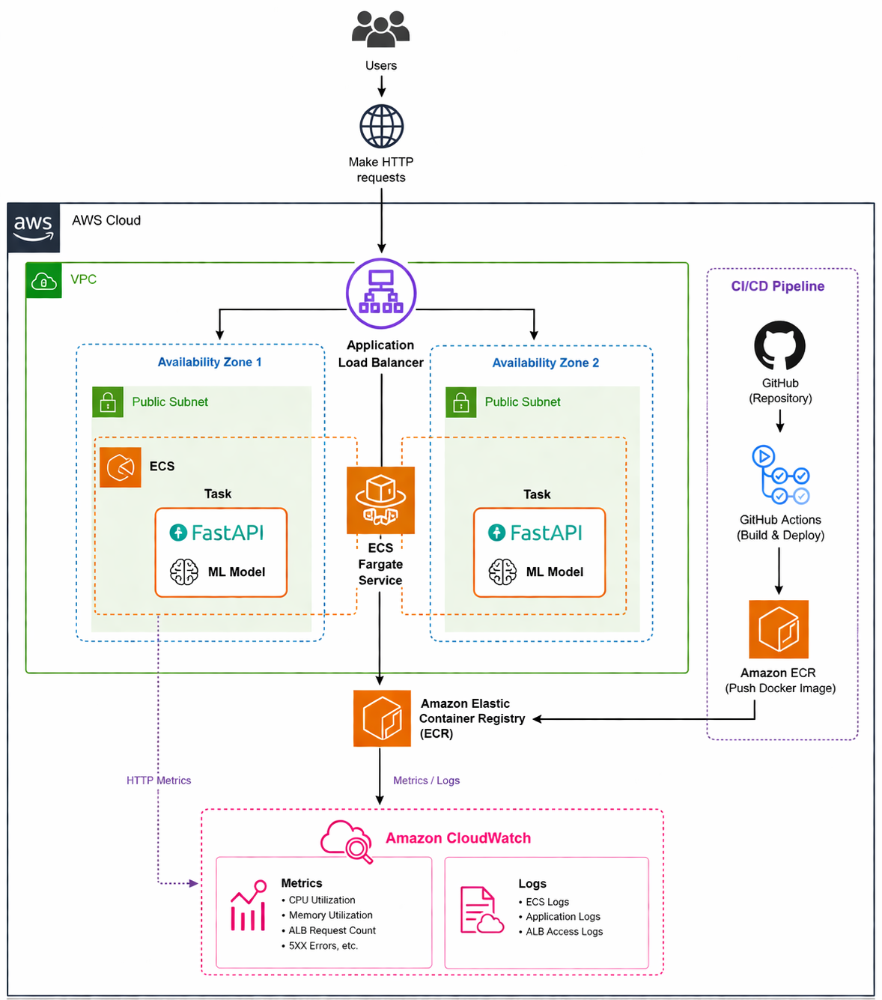
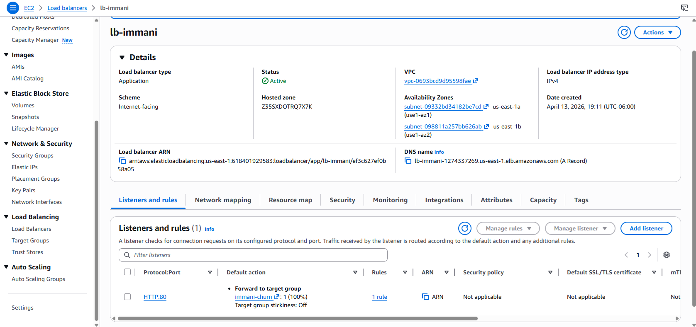
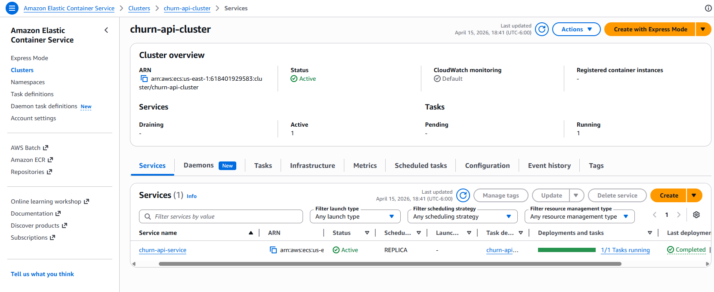
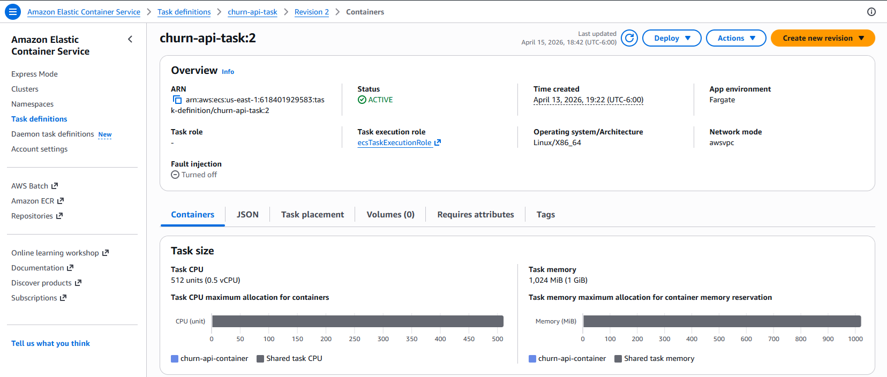
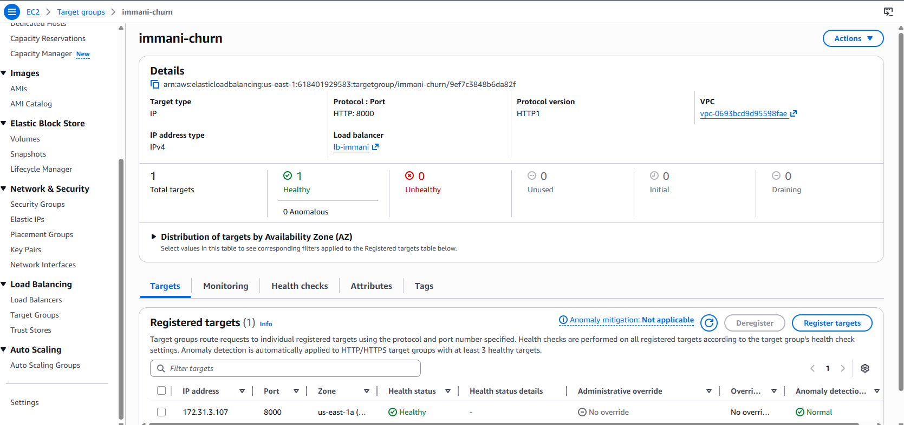
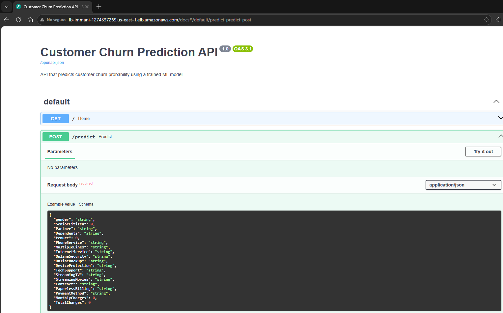
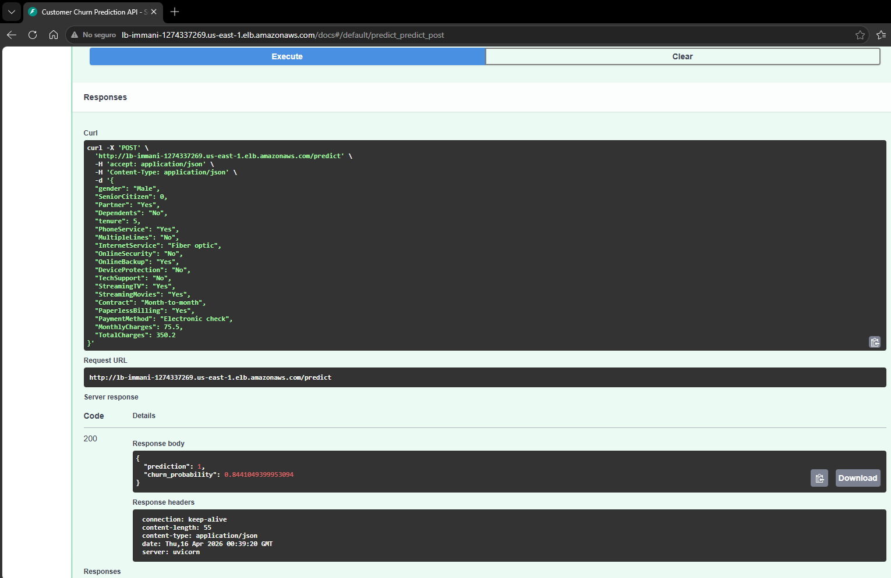
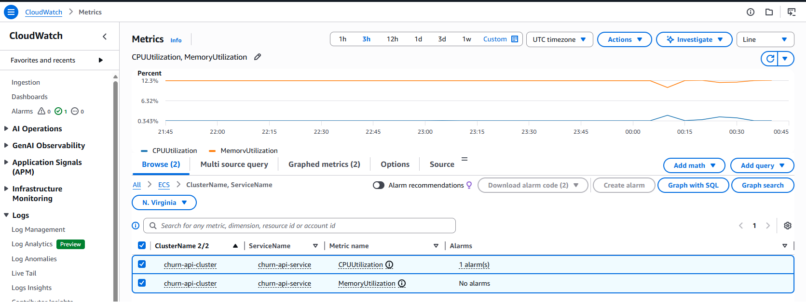
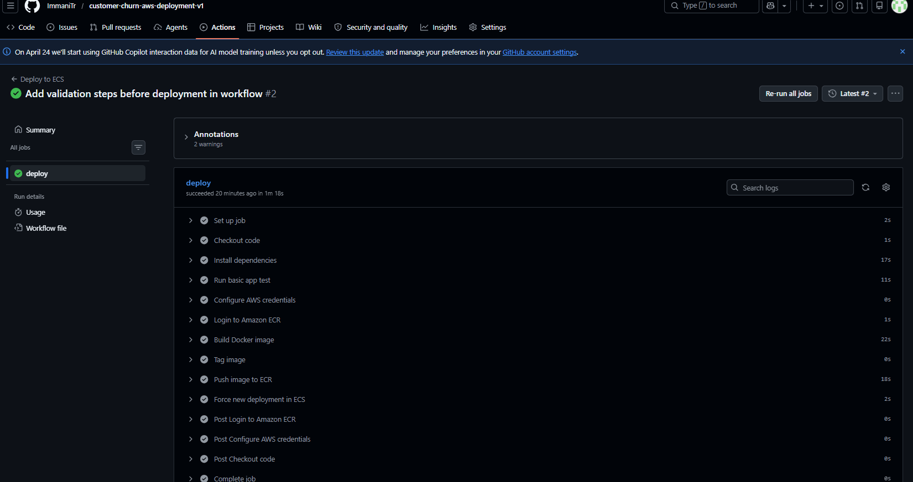

# 🚀 Customer Churn AWS Deployment v1

End-to-end deployment of a customer churn prediction model using AWS cloud services, containerization, monitoring, and CI/CD automation.

---

## 📌 Project Overview

This repository represents the **deployment and operations stage** of a complete Machine Learning workflow.  
The project exposes a trained churn prediction model through a live API running on AWS with:

- **Docker** for containerization
- **Amazon ECS Fargate** for container orchestration
- **Application Load Balancer (ALB)** for service exposure
- **Amazon ECR** for image storage
- **Amazon CloudWatch** for monitoring
- **GitHub Actions** for CI/CD automation

The final result is a production-style API that can receive customer data and return churn predictions in real time.

---

## 🔗 Project Continuity

This repository is part of a structured multi-repository portfolio that shows the full lifecycle of a Machine Learning solution.

### 1. Model Development  
**Repository:** [customer-churn-ml-v1](https://github.com/ImmaniTr/customer-churn-ml-v1)  
This repository contains the data cleaning, exploratory data analysis, feature engineering, model training, model comparison, and final model selection process.

### 2. API Development  
**Repository:** [customer-churn-ml-api-v1](https://github.com/ImmaniTr/customer-churn-ml-api-v1)  
This repository focuses on exposing the trained model through a local FastAPI application, validating the prediction endpoint before moving to the cloud.

### 3. Initial AWS Deployment  
**Repository:** [customer-churn-ml-api-aws-v1](https://github.com/ImmaniTr/customer-churn-ml-api-aws-v1)  
This repository documents the first AWS deployment stage, including Docker packaging, Amazon ECR, and the initial ECS-based deployment.

### 4. Current Repository  
**Repository:** [customer-churn-aws-deployment-v1](https://github.com/ImmaniTr/customer-churn-aws-deployment-v1)  
This repository extends the previous deployment by adding:
- Application Load Balancer
- CloudWatch monitoring
- CI/CD with GitHub Actions

---

## 🏗️ Architecture



### Architecture Summary

- Users send HTTP requests to the deployed API
- Traffic is routed through an **Application Load Balancer**
- The ALB forwards requests to the **ECS Fargate service**
- The container runs **FastAPI + the churn model**
- Logs and metrics are collected in **CloudWatch**
- New versions are deployed automatically through **GitHub Actions**

---

## ⚙️ AWS Infrastructure

### 🔹 Application Load Balancer



The Application Load Balancer provides the public entry point to the API and routes traffic to the running ECS task.

---

### 🔹 ECS Service



The ECS service ensures that the application remains available and keeps the desired number of running tasks.

---

### 🔹 Task Definition



The task definition specifies the container image, compute resources, networking mode, and runtime configuration used by the service.

---

### 🔹 Target Group Health



The target group confirms that only healthy tasks receive traffic from the ALB.

---

## 🌐 Live API

### Swagger UI
The deployed API can be accessed here:

[Live API Documentation](http://lb-immani-1274337269.us-east-1.elb.amazonaws.com/docs#/default/predict_predict_post)

### Example Endpoint
- `GET /`
- `POST /predict`

---

## 📡 API Documentation



The Swagger UI exposes the available endpoints and allows interactive testing directly from the browser.

---

## 🔮 Example Prediction



Example JSON response:

```json
{
  "prediction": 1,
  "churn_probability": 0.8441049399953094
}
```

---

## 📊 Monitoring with CloudWatch



CloudWatch is used to monitor:
- CPU utilization
- Memory utilization
- Operational visibility of the ECS service

This adds a basic observability layer to the deployment.

---

## 🔁 CI/CD with GitHub Actions



A GitHub Actions workflow was added to automate deployment.

### Pipeline flow

```text
Push to main
→ install dependencies
→ run basic validation
→ build Docker image
→ push image to Amazon ECR
→ force new ECS deployment
```

### Validation step
Before deployment, the workflow performs a basic application check to verify that the FastAPI app starts correctly and responds through `/docs`.

---

## 🔐 GitHub Secrets Used

The workflow uses repository secrets for secure deployment:

- `AWS_ACCESS_KEY_ID`
- `AWS_SECRET_ACCESS_KEY`
- `AWS_REGION`
- `ECR_REPOSITORY`
- `ECS_CLUSTER`
- `ECS_SERVICE`

---

## 🧰 Tech Stack

- Python
- FastAPI
- Scikit-learn
- Docker
- Amazon ECS Fargate
- Amazon ECR
- Application Load Balancer
- Amazon CloudWatch
- GitHub Actions

---

## 🎯 Key Skills Demonstrated

- End-to-end ML deployment
- API development with FastAPI
- Docker containerization
- AWS ECS service deployment
- Load balancer integration
- Monitoring with CloudWatch
- CI/CD automation with GitHub Actions

---

## 🚧 Future Improvements

- Image versioning instead of using only `latest`
- Rollback strategy for deployments
- More advanced CloudWatch alarms
- OIDC-based authentication instead of long-lived IAM keys
- Infrastructure as Code with Terraform

---

## 👤 Author

Immani Trejo  
Data Science | Machine Learning | Cloud Deployment

---

## 📌 Recruiter Note

This repository showcases the ability to take a Machine Learning model beyond experimentation and turn it into a deployable and operational cloud service.  
It connects model development, API design, Docker packaging, AWS deployment, monitoring, and CI/CD into one coherent end-to-end workflow.
