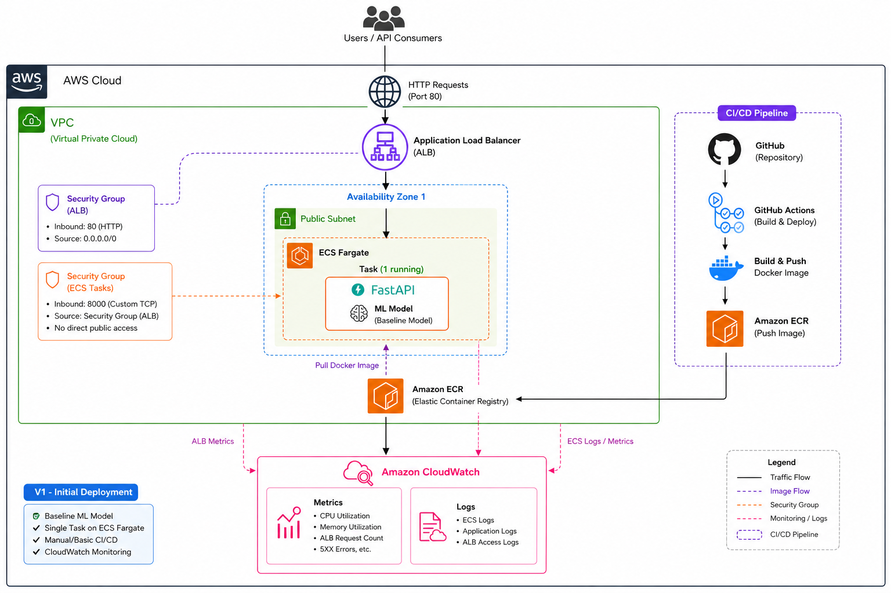
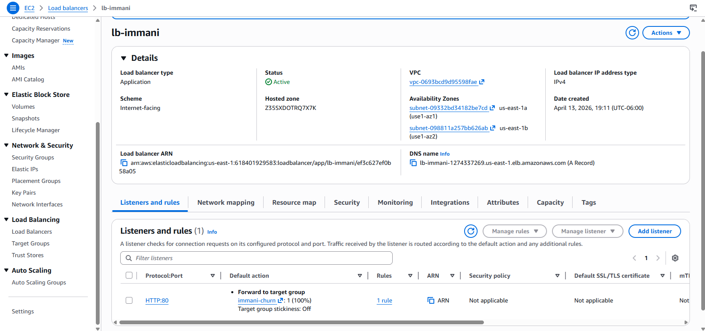
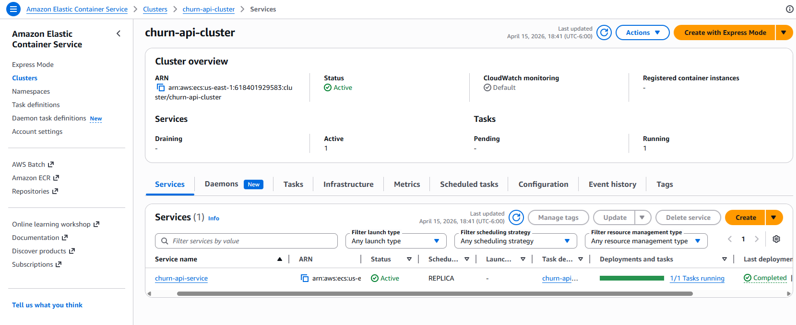
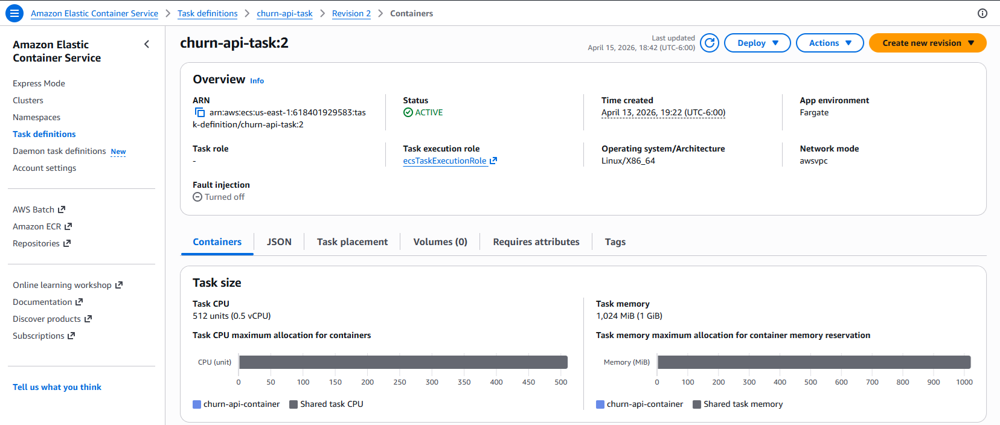
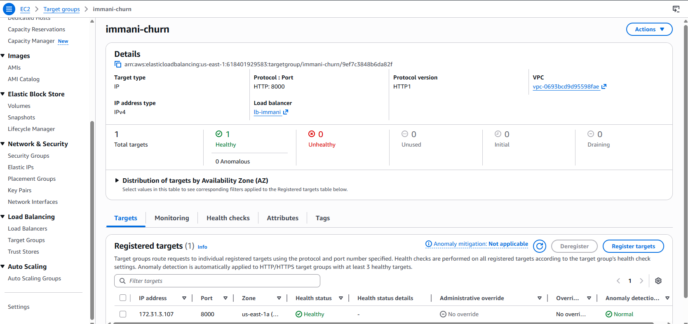
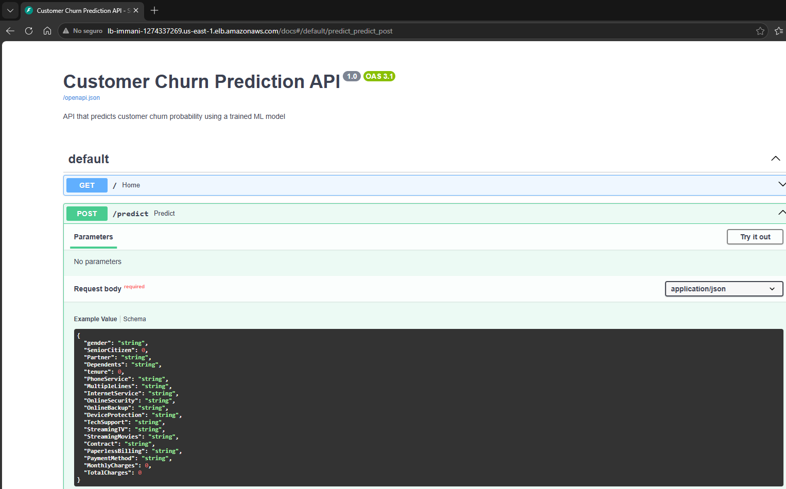
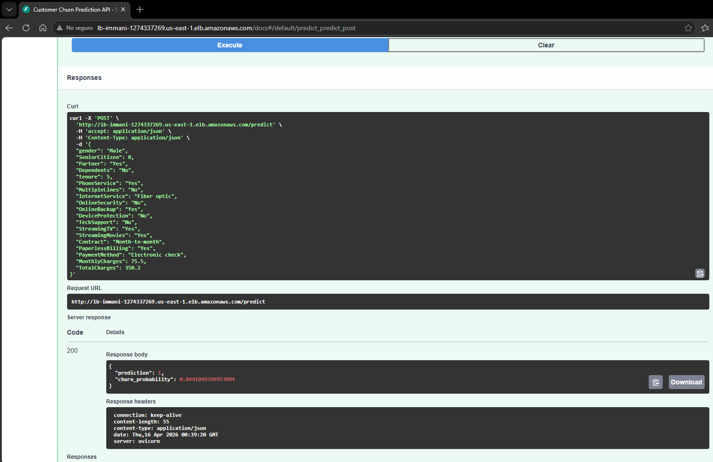
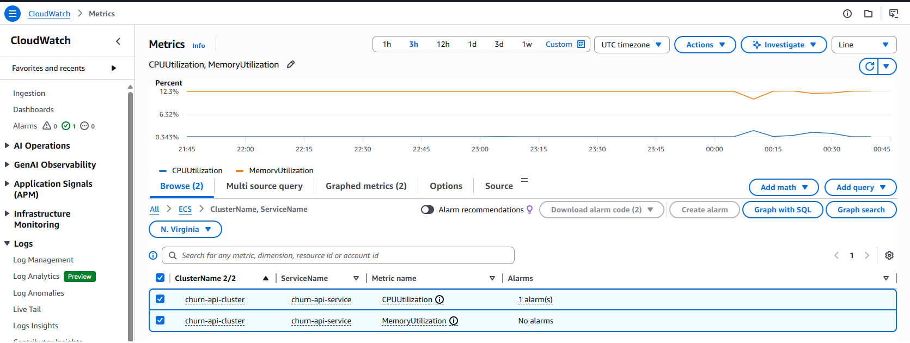
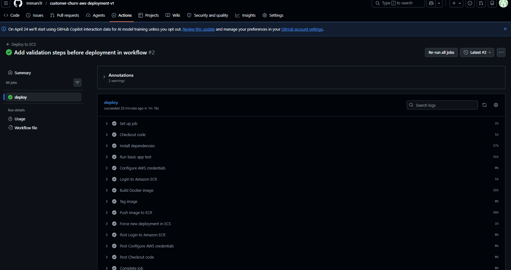

# Customer Churn AWS Deployment v1 - Production-Oriented ML Infrastructure

## Project Overview

This repository represents the final stage of the Version 1 deployment workflow of a multi-stage end-to-end Machine Learning project focused on customer churn prediction.

The objective of this phase is to transform a machine learning API into a more production-oriented cloud service by introducing:

- Application Load Balancer (ALB)
- Monitoring with Amazon CloudWatch
- CI/CD automation with GitHub Actions
- Improved AWS deployment architecture
- Operational visibility for ML services

This repository extends the previous deployment stages into a more realistic machine learning engineering and MLOps workflow.

---

# Project Ecosystem

This repository is part of a complete Machine Learning deployment workflow.

## Repository Flow

| Stage | Repository | Purpose |
|---|---|---|
| 1 | [customer-churn-ml-v1](https://github.com/ImmaniTr/customer-churn-ml-v1) | Data analysis, preprocessing, modeling and evaluation |
| 2 | [customer-churn-ml-api-v1](https://github.com/ImmaniTr/customer-churn-ml-api-v1) | Local FastAPI implementation for real-time predictions |
| 3 | [customer-churn-ml-api-aws-v1](https://github.com/ImmaniTr/customer-churn-ml-api-aws-v1) | Initial AWS deployment using Docker and ECS |
| 4 | [customer-churn-aws-deployment-v1](https://github.com/ImmaniTr/customer-churn-aws-deployment-v1) | Production-oriented deployment with ALB, monitoring and CI/CD |
| 5 | [customer-churn-ml-v2](https://github.com/ImmaniTr/customer-churn-ml-v2) | Improved XGBoost model with threshold optimization |
| 6 | [customer-churn-aws-deployment-v2](https://github.com/ImmaniTr/customer-churn-aws-deployment-v2) | Production deployment with metric validation gates and improved MLOps workflow |

---

# Project Evolution

This repository represents the most advanced deployment stage of Version 1 of the project.

The project evolved through:
1. Machine learning experimentation
2. FastAPI serving layer
3. Docker containerization
4. Initial AWS deployment
5. Production-oriented infrastructure improvements
6. Monitoring and CI/CD automation

The project later continued into Version 2 with:
- Improved XGBoost model
- Threshold optimization
- Metric validation gates
- Stronger production governance
- More mature CI/CD workflows

---

## Relationship with Previous Repositories

### Modeling Repository
[customer-churn-ml-v1](https://github.com/ImmaniTr/customer-churn-ml-v1)

Includes:
- Exploratory Data Analysis (EDA)
- Feature Engineering
- Model Training
- Model Evaluation
- Final Pipeline Packaging

### API Repository
[customer-churn-ml-api-v1](https://github.com/ImmaniTr/customer-churn-ml-api-v1)

Includes:
- FastAPI serving layer
- Real-time prediction endpoints
- Structured input validation
- Swagger documentation

### Initial AWS Deployment Repository
[customer-churn-ml-api-aws-v1](https://github.com/ImmaniTr/customer-churn-ml-api-aws-v1)

Includes:
- Docker packaging
- Amazon ECR
- ECS Fargate deployment
- Initial cloud infrastructure

This repository extends those stages by adding monitoring, load balancing, and CI/CD automation.

---

# Version 2 Continuation

After completing the Version 1 deployment workflow, the project evolved into a second-generation architecture focused on stronger predictive performance and more mature MLOps practices.

## Version 2 Improvements

### Improved Modeling
Repository:
[customer-churn-ml-v2](https://github.com/ImmaniTr/customer-churn-ml-v2)

Enhancements introduced:
- XGBoost implementation
- Threshold optimization
- Improved churn recall
- Better business-oriented decision boundary
- Comparative model analysis against Version 1

### Production-Oriented Deployment
Repository:
[customer-churn-aws-deployment-v2](https://github.com/ImmaniTr/customer-churn-aws-deployment-v2)

Enhancements introduced:
- Metric validation gates before deployment
- Stronger CI/CD workflow
- Basic ML governance layer
- More mature production deployment process
- Improved prediction responses and operational workflows

This evolution demonstrates the transition from:
- baseline deployment
to:
- iterative machine learning lifecycle improvement

---

## Architecture



### Architecture Summary

- Users send HTTP requests to the deployed API
- Traffic is routed through an Application Load Balancer
- The ALB forwards requests to the ECS Fargate service
- Containers run FastAPI and the churn prediction model
- Logs and metrics are collected through CloudWatch
- GitHub Actions automates deployments

---

## AWS Infrastructure

### Application Load Balancer



The ALB provides:
- public access to the API
- traffic routing
- improved service exposure
- health-based request forwarding

---

### ECS Service



The ECS service maintains:
- desired running tasks
- service availability
- container orchestration

---

### ECS Task Definition



The task definition specifies:
- container image
- runtime configuration
- compute resources
- networking settings

---

### Target Group Health



The target group ensures that only healthy tasks receive traffic from the ALB.

---

## Live API

### Swagger Documentation

The deployed API can be accessed through:

```bash
http://lb-immani-1274337269.us-east-1.elb.amazonaws.com/docs#/default/predict_predict_post
```

### Available Endpoints

- `GET /`
- `POST /predict`

---

## API Documentation



Swagger UI allows:
- endpoint exploration
- schema validation
- real-time testing

---

## Example Prediction



Example JSON response:

```json
{
  "prediction": 1,
  "churn_probability": 0.8441049399953094
}
```

---

## Monitoring with CloudWatch



CloudWatch was implemented to monitor:
- CPU utilization
- memory utilization
- ECS operational visibility
- infrastructure metrics

This introduces a basic observability layer into the ML deployment lifecycle.

---

## CI/CD with GitHub Actions



A GitHub Actions workflow automates deployment updates.

### Pipeline Flow

```text
Push to main
→ install dependencies
→ run validation
→ build Docker image
→ push image to Amazon ECR
→ force ECS deployment update
```

### Validation Step

Before deployment, the workflow validates:
- FastAPI startup
- endpoint availability
- `/docs` accessibility

---

## GitHub Secrets Used

The deployment workflow uses GitHub Secrets for secure authentication and configuration management.

### Secrets

- `AWS_ACCESS_KEY_ID`
- `AWS_SECRET_ACCESS_KEY`
- `AWS_REGION`
- `ECR_REPOSITORY`
- `ECS_CLUSTER`
- `ECS_SERVICE`

---

## Technologies Used

- Python
- FastAPI
- Scikit-learn
- Docker
- Amazon ECS Fargate
- Amazon ECR
- Application Load Balancer
- Amazon CloudWatch
- GitHub Actions

---

## Key Skills Demonstrated

- End-to-end ML deployment
- Production-oriented ML infrastructure
- API deployment with FastAPI
- Docker containerization
- AWS ECS deployment
- Load balancer integration
- Monitoring and observability
- CI/CD automation

---

## Future Improvements

Potential future improvements include:
- image versioning strategies
- rollback deployment workflows
- advanced CloudWatch alarms
- Infrastructure as Code with Terraform
- OIDC authentication for GitHub Actions

---

## Key Insight

This repository demonstrates the transition from:

**Machine Learning Deployment → Operational ML Infrastructure**

It introduces:
- monitoring
- deployment automation
- infrastructure management
- production-oriented deployment workflows

It also serves as the foundation for the more advanced Version 2 MLOps workflow.

---

## Author

**Immani Trejo**  
Data Science | Machine Learning | Cloud Deployment

Background in:
- IT consulting
- machine learning
- cloud deployment
- infrastructure operations
- end-to-end ML workflows

---

## Recruiter Note

This repository showcases the ability to operationalize a machine learning service using modern cloud and deployment technologies.

It demonstrates:
- deployment automation
- monitoring integration
- scalable infrastructure design
- CI/CD implementation
- production-oriented machine learning workflows

This repository represents the operational and infrastructure stage of the Version 1 workflow and serves as the foundation for the more advanced Version 2 deployment architecture.
